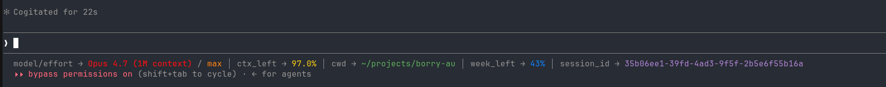

# cc-statusline

Fast Rust statusline for [Claude Code](https://claude.com/claude-code). Drop-in replacement for the shell/Python statusline scripts, with a ~30× faster cold-start.

It also **tracks context usage over time**: on every render it upserts the session's remaining-context % (plus a render `count` and timestamp) into a small SQLite DB, and ships a companion **`ctx-left`** binary + Claude Code skill to query it. SQLite is compiled in (bundled) — no external `sqlite3`, no system libs, portable to Windows/macOS/Linux.



## What it shows

| Field          | Source                                          |
| -------------- | ----------------------------------------------- |
| `model/effort` | `model.display_name` / `effort.level`           |
| `ctx_left`     | `context_window.remaining_percentage`           |
| `cwd`          | `cwd` (with `$HOME` folded to `~`)              |
| `5h_left`      | `100 - rate_limits.five_hour.used_percentage`   |
| `7d_left`      | `100 - rate_limits.seven_day.used_percentage`   |
| `session_id`   | `session_id`                                    |

## Install

**Prerequisites (from source):** [Rust](https://rustup.rs) and a C compiler for the bundled SQLite — on **Windows** the *MSVC Build Tools* (C++), on **macOS** the Xcode Command Line Tools, on **Linux** `gcc`/`clang`.

```bash
git clone https://github.com/efebia-com/cc-statusline.git
cd cc-statusline

sh install.sh        # macOS / Linux
.\install.ps1        # Windows (PowerShell)
```

The script builds + installs both binaries (`statusline`, `ctx-left`) into `~/.cargo/bin` (on your `PATH`), copies the `ctx-left` skill into `~/.claude/skills/ctx-left/`, and points `statusLine.command` in `~/.claude/settings.json` at the installed `statusline` — merging, so it won't clobber your other settings.

**Restart Claude Code** afterwards to load the statusline. Then try: `ctx-left --all`.

### Manual configure

Prefer not to run the script? Build with `cargo build --release` and add this to `~/.claude/settings.json` (absolute path to the binary):

```json
{
  "statusLine": {
    "type": "command",
    "command": "/absolute/path/to/cc-statusline/target/release/statusline"
  }
}
```

To use the skill, copy `skill/ctx-left/SKILL.md` to `~/.claude/skills/ctx-left/SKILL.md` and make sure `ctx-left` is on your `PATH` (or edit the skill to use an absolute path).

## Context tracking + the `ctx-left` skill

On every render the statusline upserts one row per session into `~/.claude/ctx.db`:

| Column          | Meaning                                          |
| --------------- | ------------------------------------------------ |
| `session_id`    | the session UUID (primary key)                   |
| `count`         | how many times the statusline has rendered       |
| `ts`            | unix time of the last render                     |
| `remaining_pct` | last `context_window.remaining_percentage`       |

Concurrent sessions write safely (WAL + `busy_timeout`); sessions idle for more than 7 days are pruned automatically. Query it with the bundled binary (also exposed as a Claude Code skill):

```bash
ctx-left              # current session (uses $CLAUDE_CODE_SESSION_ID)
ctx-left <uuid>       # a specific session
ctx-left --all        # every tracked session
```

Because `remaining_pct` is an integer, the same % can hide thousands of tokens of movement on a large window — so `count` + `ts` let a reader tell a *fresh* reading from a stale one even when the % hasn't ticked.

## Input format

Claude Code pipes a JSON payload to the statusline's stdin and reads the rendered line from stdout. See [`examples/sample-input.json`](examples/sample-input.json) for the full schema — it includes `model`, `workspace`, `cost`, `context_window`, `rate_limits`, and more.

To capture a live sample from your own session, add a single line to `main()`:

```rust
std::fs::write("/tmp/statusline-input.json", &buf).ok();
```

## Customize

Edit `src/main.rs`:

- **Layout / which fields appear** — the `fields` array near the bottom of `main()`
- **Color palette** — the `colorize` function at the top
- **Context persistence** — the `persist` function (schema, retention window)

The `ctx-left` reader is `src/bin/ctx-left.rs`. Rebuild with `cargo build --release`.

## License

MIT — see [LICENSE](LICENSE).
